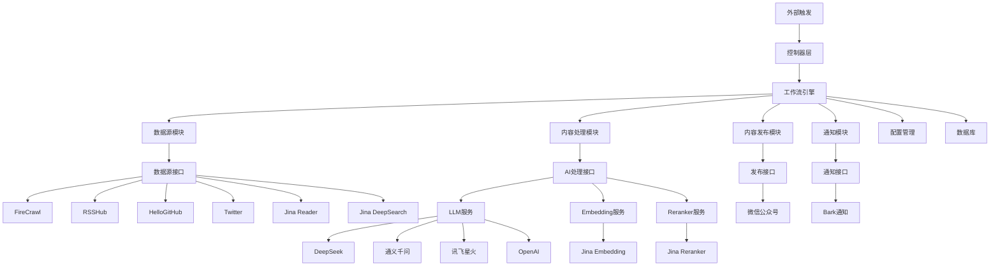

# 架构设计说明文档

## 1. 引言

### 1.1 目的
本文档旨在描述 AI Trend Publish 系统的整体架构设计，包括系统组件、模块划分、数据流和交互关系。

### 1.2 范围
本文档覆盖系统的整体架构设计，包括：
- 系统架构图
- 核心组件说明
- 模块设计
- 数据流设计
- 部署架构

## 2. 系统架构概述

### 2.1 技术栈
- 运行时环境：Deno
- 编程语言：TypeScript
- 数据库：SQLite/MySQL
- 通信协议：HTTP/JSON-RPC
- 构建工具：Deno 内置工具

### 2.2 架构风格
采用微服务架构风格，通过模块化设计实现功能解耦，便于扩展和维护。

## 3. 系统架构图

## 4. 核心组件说明

### 4.1 控制器层 (Controller Layer)
负责接收外部请求，包括定时任务触发和手动触发的 RPC 调用。

### 4.2 工作流引擎 (Workflow Engine)
系统的核心引擎，负责协调各个模块完成内容抓取、处理和发布的完整流程。

### 4.3 数据源模块 (Data Source Module)
负责从各种数据源抓取原始内容，支持多种抓取器实现。

### 4.4 内容处理模块 (Content Processing Module)
对抓取的内容进行 AI 处理，包括摘要生成、去重、排名等。

### 4.5 内容发布模块 (Content Publishing Module)
将处理后的内容发布到指定平台，如微信公众号。

### 4.6 通知模块 (Notification Module)
负责系统通知和状态推送。

## 5. 模块设计

### 5.1 工厂模式模块
- ScraperFactory: 数据源抓取器工厂
- LLMFactory: 大语言模型工厂
- EmbeddingFactory: 向量嵌入服务工厂
- PublisherFactory: 内容发布器工厂
- NotifyFactory: 通知服务工厂

### 5.2 接口定义模块
- ScraperInterface: 数据源抓取器接口
- LLMInterface: 大语言模型接口
- EmbeddingInterface: 向量嵌入接口
- PublisherInterface: 内容发布器接口
- NotifyInterface: 通知服务接口

### 5.3 服务模块
- VectorService: 向量服务
- WorkflowService: 工作流服务

### 5.4 工具模块
- ConfigManager: 配置管理器
- HttpClient: HTTP 客户端
- DatabaseFactory: 数据库工厂
- RetryUtil: 重试工具

## 6. 数据流设计

### 6.1 内容抓取流程
1. 工作流启动
2. 通过 ScraperFactory 获取指定数据源抓取器
3. 调用抓取器获取内容
4. 存储原始内容到数据库

### 6.2 内容处理流程
1. 从数据库获取待处理内容
2. 使用 LLM 生成内容摘要
3. 使用 Embedding 服务生成向量表示
4. 通过向量相似度去重
5. 使用 Reranker 对内容进行排名
6. 存储处理结果

### 6.3 内容发布流程
1. 从数据库获取待发布内容
2. 使用模板渲染器生成发布内容
3. 通过 Publisher 发布到指定平台
4. 更新发布状态

### 6.4 通知流程
1. 监控系统状态
2. 通过 NotifyFactory 获取通知服务
3. 发送通知消息

## 7. 部署架构

### 7.1 单机部署
所有组件部署在同一台服务器上，适用于小型应用。

### 7.2 分布式部署
各模块可以独立部署，通过 API 进行通信，适用于大型应用。

## 8. 安全设计

### 8.1 数据安全
- 敏感配置信息通过环境变量管理
- 数据库访问控制
- API 访问权限控制

### 8.2 通信安全
- HTTPS 通信
- API 密钥保护
- 请求签名验证

## 9. 性能设计

### 9.1 并发处理
- 支持多数据源并发抓取
- 支持批量内容处理
- 异步任务处理

### 9.2 缓存机制
- 数据库连接池
- 服务实例缓存
- API 响应缓存

## 10. 可扩展性设计

### 10.1 插件化架构
- 通过工厂模式支持新服务的动态添加
- 接口化设计便于扩展新功能
- 配置化管理便于功能开关

### 10.2 微服务化
- 各模块可独立部署和扩展
- 通过标准接口进行通信
- 支持负载均衡和故障转移