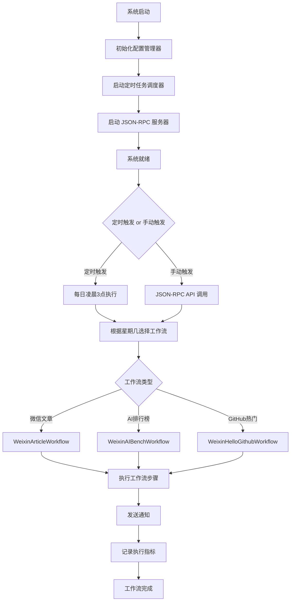
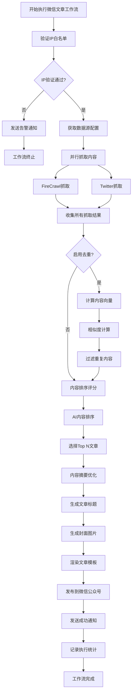
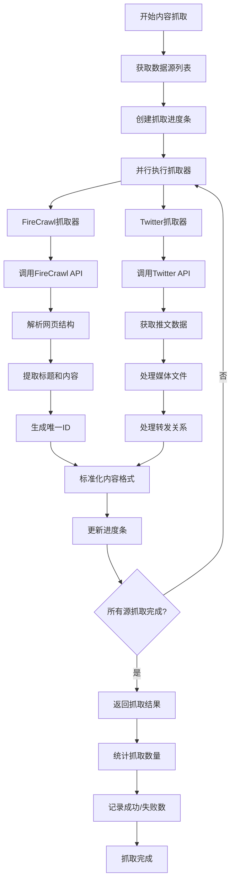
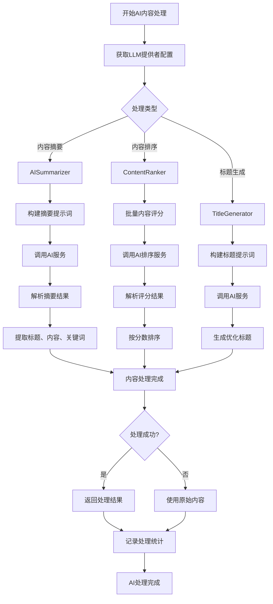
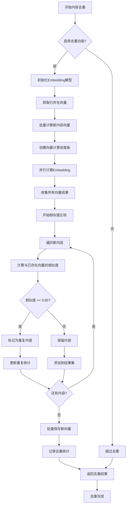
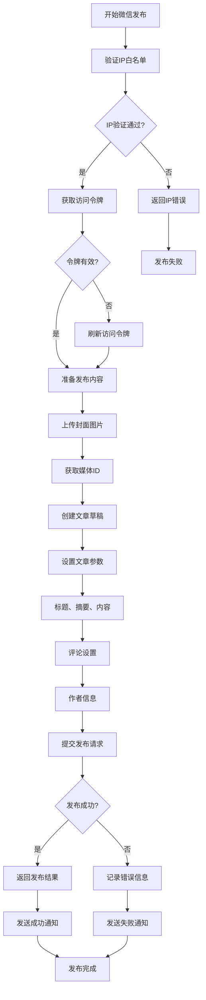
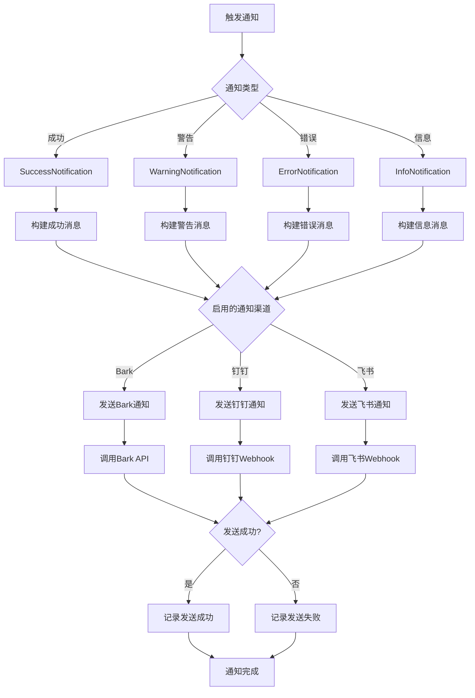
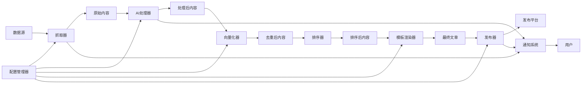

# TrendPublish 核心流程图和模块说明

## 1. 系统整体流程图

## 2. 微信文章工作流详细流程

## 3. 内容抓取模块流程

## 4. AI内容处理流程

## 5. 向量化去重流程

## 6. 微信发布流程

## 7. 通知系统流程

## 8. 核心模块说明

### 8.1 工作流引擎 (Workflow Engine)

**职责**：
- 工作流生命周期管理
- 步骤执行和重试控制
- 错误处理和恢复
- 执行指标收集

**核心类**：
- `WorkflowEntrypoint`：工作流基类
- `WorkflowStep`：步骤执行器
- `MetricsCollector`：指标收集器

**特性**：
- 支持步骤重试和超时控制
- 区分可重试错误和终止错误
- 详细的执行指标统计
- 灵活的错误处理机制

### 8.2 内容抓取模块 (Content Scraper)

**职责**：
- 多数据源内容抓取
- 数据标准化处理
- 错误处理和重试
- 抓取进度跟踪

**核心类**：
- `FireCrawlScraper`：网页内容抓取
- `TwitterScraper`：社交媒体抓取
- `HelloGithubScraper`：开源项目抓取
- `ScraperFactory`：抓取器工厂

**特性**：
- 统一的抓取接口
- 并行抓取支持
- 自动错误恢复
- 实时进度显示

### 8.3 AI内容处理模块 (AI Content Processor)

**职责**：
- 内容智能摘要
- 质量评分排序
- 标题优化生成
- 关键词提取

**核心类**：
- `AISummarizer`：内容摘要器
- `ContentRanker`：内容排序器
- `LLMFactory`：AI服务工厂
- `EmbeddingProvider`：向量化服务

**特性**：
- 多AI服务支持
- 批量处理优化
- 智能提示词工程
- 结果质量控制

### 8.4 向量化去重模块 (Vector Deduplication)

**职责**：
- 文本向量化
- 相似度计算
- 重复内容检测
- 向量数据管理

**核心类**：
- `VectorService`：向量数据服务
- `EmbeddingFactory`：嵌入模型工厂
- `VectorSimilarityUtil`：相似度计算工具

**特性**：
- 高效的向量计算
- 可配置相似度阈值
- 批量向量处理
- 内存优化算法

### 8.5 内容发布模块 (Content Publisher)

**职责**：
- 多平台内容发布
- 媒体文件管理
- 发布状态跟踪
- 权限验证

**核心类**：
- `WeixinPublisher`：微信公众号发布器
- `WeixinArticleTemplateRenderer`：模板渲染器
- `ImageGenerator`：图片生成器

**特性**：
- 自动访问令牌管理
- 多模板支持
- 图片自动上传
- 发布前验证

### 8.6 通知系统模块 (Notification System)

**职责**：
- 多渠道消息推送
- 任务状态通知
- 错误告警
- 通知模板管理

**核心类**：
- `BarkNotifier`：Bark通知器
- `DingDingNotifier`：钉钉通知器
- `FeishuNotifier`：飞书通知器

**特性**：
- 多通知渠道支持
- 消息模板化
- 异步发送
- 发送状态跟踪

### 8.7 配置管理模块 (Configuration Manager)

**职责**：
- 多层级配置管理
- 动态配置更新
- 配置验证
- 默认值处理

**核心类**：
- `ConfigManager`：配置管理器
- `EnvironmentConfigSource`：环境变量配置源
- `DatabaseConfigSource`：数据库配置源

**特性**：
- 配置优先级管理
- 运行时配置更新
- 配置缓存机制
- 类型安全的配置访问

## 9. 数据流向图

这个流程图和模块说明文档详细描述了 TrendPublish 系统的核心工作流程、各个模块的职责和相互关系，为开发者和用户提供了清晰的系统理解框架。