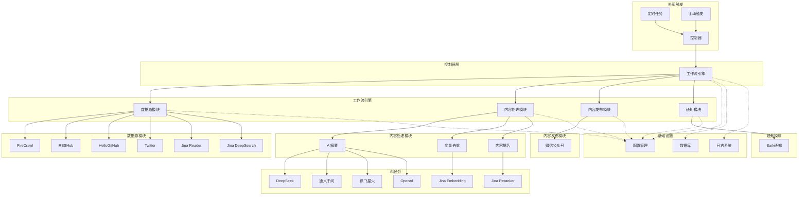

# TrendPublish 核心流程图和模块说明

## 1. 系统流程图

## 1. 微信文章工作流

``mermaid
graph TD
    A[开始工作流] --> B[验证IP白名单]
    B --> C[获取数据源配置]
    C --> D[并发抓取内容]
    D --> E[内容去重处理]
    E --> F[内容评分排名]
    F --> G[处理排名后内容]
    G --> H[生成文章]
    H --> I[发布到微信公众号]
    I --> J[发送完成通知]
    J --> K[结束工作流]

    D1[FireCrawl数据源] --> D
    D2[Twitter数据源] --> D
    D3[其他数据源] --> D

    E1[初始化Embedding模型] --> E
    E2[计算内容向量] --> E
    E3[相似度比较] --> E
    E4[过滤重复内容] --> E

    F1[AI内容排名] --> F
    F2[按分数排序] --> F

    G1[获取前N篇文章] --> G
    G2[内容润色处理] --> G

    H1[生成总标题] --> H
    H2[生成封面图片] --> H
    H3[上传图片素材] --> H
    H4[渲染文章模板] --> H
```

## 2. 数据源抓取流程

``mermaid
graph TD
    A[开始抓取] --> B[获取数据源列表]
    B --> C{数据源类型}
    C -->|FireCrawl| D[FireCrawl抓取器]
    C -->|Twitter| E[Twitter抓取器]
    C -->|RSSHub| F[RSSHub抓取器]
    C -->|其他| G[其他抓取器]
    D --> H[执行抓取]
    E --> H
    F --> H
    G --> H
    H --> I[返回抓取结果]
    I --> J[结束抓取]
```

## 3. 内容处理流程

``mermaid
graph TD
    A[开始处理] --> B[内容去重]
    B --> C[内容排名]
    C --> D[内容润色]
    D --> E[生成摘要]
    E --> F[提取关键词]
    F --> G[计算阅读时间]
    G --> H[结束处理]
```

## 4. 内容发布流程

``mermaid
graph TD
    A[开始发布] --> B[生成文章标题]
    B --> C[生成封面图片]
    C --> D[上传图片素材]
    D --> E[渲染文章模板]
    E --> F[上传草稿]
    F --> G[发布文章]
    G --> H[返回发布结果]
    H --> I[结束发布]
```

## 5. 系统架构图



## 6. 微信发布流程

``mermaid
graph TD
    A[开始微信发布] --> B[验证IP白名单]
    B --> C{IP验证通过?}
    C -->|否| D[返回IP错误]
    C -->|是| E[获取访问令牌]
    
    E --> F{令牌有效?}
    F -->|否| G[刷新访问令牌]
    F -->|是| H[准备发布内容]
    
    G --> H
    
    H --> I[上传封面图片]
    I --> J[获取媒体ID]
    J --> K[创建文章草稿]
    
    K --> L[设置文章参数]
    L --> M[标题、摘要、内容]
    M --> N[评论设置]
    N --> O[作者信息]
    
    O --> P[提交发布请求]
    P --> Q{发布成功?}
    
    Q -->|是| R[返回发布结果]
    Q -->|否| S[记录错误信息]
    
    R --> T[发送成功通知]
    S --> U[发送失败通知]
    
    T --> V[发布完成]
    U --> V
    
    D --> W[发布失败]
```

## 7. 通知系统流程

``mermaid
graph TD
    A[触发通知] --> B{通知类型}
    
    B -->|成功| C[SuccessNotification]
    B -->|警告| D[WarningNotification]
    B -->|错误| E[ErrorNotification]
    B -->|信息| F[InfoNotification]
    
    C --> G[构建成功消息]
    D --> H[构建警告消息]
    E --> I[构建错误消息]
    F --> J[构建信息消息]
    
    G --> K{启用的通知渠道}
    H --> K
    I --> K
    J --> K
    
    K -->|Bark| L[发送Bark通知]
    K -->|钉钉| M[发送钉钉通知]
    K -->|飞书| N[发送飞书通知]
    
    L --> O[调用Bark API]
    M --> P[调用钉钉Webhook]
    N --> Q[调用飞书Webhook]
    
    O --> R{发送成功?}
    P --> R
    Q --> R
    
    R -->|是| S[记录发送成功]
    R -->|否| T[记录发送失败]
    
    S --> U[通知完成]
    T --> U
```

## 8. 核心模块说明

### 8.1 工作流引擎 (Workflow Engine)

**职责**：
- 工作流生命周期管理
- 步骤执行和重试控制
- 错误处理和恢复
- 执行指标收集

**核心类**：
- `WorkflowEntrypoint`：工作流基类
- `WorkflowStep`：步骤执行器
- `MetricsCollector`：指标收集器

**特性**：
- 支持步骤重试和超时控制
- 区分可重试错误和终止错误
- 详细的执行指标统计
- 灵活的错误处理机制

### 8.2 内容抓取模块 (Content Scraper)

**职责**：
- 多数据源内容抓取
- 数据标准化处理
- 错误处理和重试
- 抓取进度跟踪

**核心类**：
- `FireCrawlScraper`：网页内容抓取
- `TwitterScraper`：社交媒体抓取
- `HelloGithubScraper`：开源项目抓取
- `ScraperFactory`：抓取器工厂

**特性**：
- 统一的抓取接口
- 并行抓取支持
- 自动错误恢复
- 实时进度显示

### 8.3 AI内容处理模块 (AI Content Processor)

**职责**：
- 内容智能摘要
- 质量评分排序
- 标题优化生成
- 关键词提取

**核心类**：
- `AISummarizer`：内容摘要器
- `ContentRanker`：内容排序器
- `LLMFactory`：AI服务工厂
- `EmbeddingProvider`：向量化服务

**特性**：
- 多AI服务支持
- 批量处理优化
- 智能提示词工程
- 结果质量控制

### 8.4 向量化去重模块 (Vector Deduplication)

**职责**：
- 文本向量化
- 相似度计算
- 重复内容检测
- 向量数据管理

**核心类**：
- `VectorService`：向量数据服务
- `EmbeddingFactory`：嵌入模型工厂
- `VectorSimilarityUtil`：相似度计算工具

**特性**：
- 高效的向量计算
- 可配置相似度阈值
- 批量向量处理
- 内存优化算法

### 8.5 内容发布模块 (Content Publisher)

**职责**：
- 多平台内容发布
- 媒体文件管理
- 发布状态跟踪
- 权限验证

**核心类**：
- `WeixinPublisher`：微信公众号发布器
- `WeixinArticleTemplateRenderer`：模板渲染器
- `ImageGenerator`：图片生成器

**特性**：
- 自动访问令牌管理
- 多模板支持
- 图片自动上传
- 发布前验证

### 8.6 通知系统模块 (Notification System)

**职责**：
- 多渠道消息推送
- 任务状态通知
- 错误告警
- 通知模板管理

**核心类**：
- `BarkNotifier`：Bark通知器
- `DingDingNotifier`：钉钉通知器
- `FeishuNotifier`：飞书通知器

**特性**：
- 多通知渠道支持
- 消息模板化
- 异步发送
- 发送状态跟踪

### 8.7 配置管理模块 (Configuration Manager)

**职责**：
- 多层级配置管理
- 动态配置更新
- 配置验证
- 默认值处理

**核心类**：
- `ConfigManager`：配置管理器
- `EnvironmentConfigSource`：环境变量配置源
- `DatabaseConfigSource`：数据库配置源

**特性**：
- 配置优先级管理
- 运行时配置更新
- 配置缓存机制
- 类型安全的配置访问

## 9. 数据流向图

``mermaid
graph LR
    A[数据源] --> B[抓取器]
    B --> C[原始内容]
    C --> D[AI处理器]
    D --> E[处理后内容]
    E --> F[向量化器]
    F --> G[去重后内容]
    G --> H[排序器]
    H --> I[排序后内容]
    I --> J[模板渲染器]
    J --> K[最终文章]
    K --> L[发布器]
    L --> M[发布平台]
    
    N[配置管理器] --> B
    N --> D
    N --> F
    N --> J
    N --> L
    
    O[通知系统] --> P[用户]
    L --> O
    D --> O
    B --> O
```

这个流程图和模块说明文档详细描述了 TrendPublish 系统的核心工作流程、各个模块的职责和相互关系，为开发者和用户提供了清晰的系统理解框架。